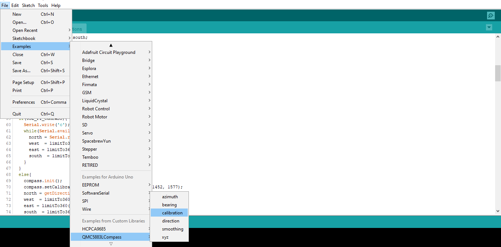
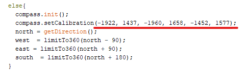
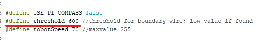

# Snowplow Robot

## Download Source Code
Download and unzip this repository to your preffered location.

Or,

Run the following commands to download this repository to the desktop

## Install Arduino on raspberry pi
Run the following commands first in terminal to update and upgrade rpi packages and version
```bash
sudo apt-get update
sudo apt-get upgrade
```

Next thing to do is to install the Arduino IDE by entering the command in the terminal.
```bash
sudo apt-get install arduino
```
Now open the Arduino IDE from the main menu option of the Raspberry Pi.


## Install Arduino Libraries

To install the library with Library Manager, open Arduino IDE and then go to **Sketch** > **Include Library** > **Manage Libraries**.
Make sure your computer is connected to the internet.

 To install **QMC5883LCompass** library, search `QMC5883LCompass` on Library Manager and install `version 1.1.1` by `MRPrograms`


## Install Python Libraries
Python should be installed by default on raspberry pi, if not we will install Python3 using the following command in the terminal:
```bash
sudo apt-get install python3
```
Now, install the pip module which is required to install the packages in Python3. So we use the following command for installation:
```bash
sudo apt install python3-pip
```
 Now we are done with python setup and start with the package installation
* Install `pyserial` by following command
```bash
sudo pip3 install pyserial
```

* Install `BeautifulSoup` by following command
```bash
sudo pip3 install beautifulsoup4
```

## Calibrate Compass
* Open Aduino IDE and go to **File** > **Examples** > **QMC5883LCompass** and open **calibration** sketch.


* Upload the sketch and open serial monitor to follow instrctions there to get a set of values. Copy that beforehand.

* Open **V2(BoundaryWires)** > **arduinoFirmware** > **arduinoFirmware.ino**
* Search for the line `compass.setCalibration`
* Relace these values here with values copied values from serial monitor.


## Find Bounadry wire threshold
* Open **V2(BoundaryWires)** > **testBoundaryWires** > **testBoundaryWires.ino**
* Upload the sketch and open serial monitor to checkout values received while sensors are on boundary wire and not.
* Make best guess to find a threshold value that seperats those states.
* Relace new thresholod value on **arduinoFirmware.ino** 


## Upload the Firmware
Upload **arduinoFirmware.ino** and you will be good to go...